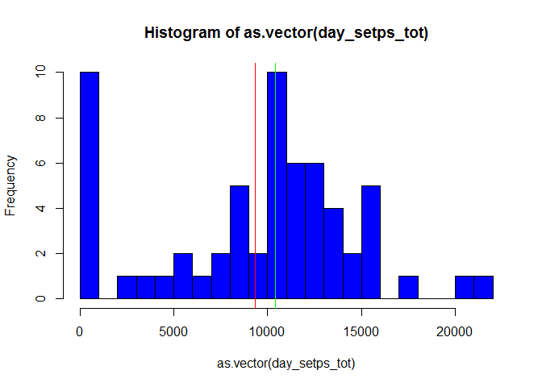
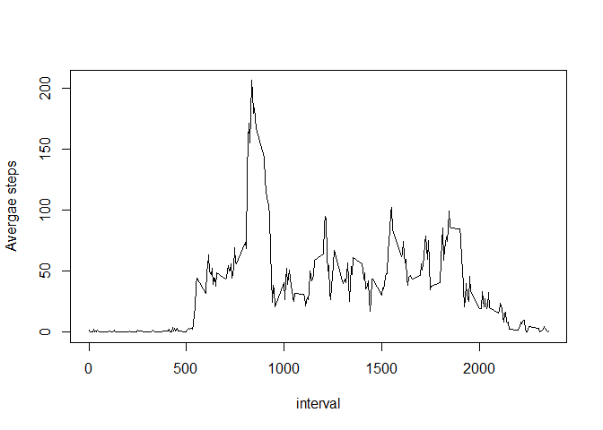
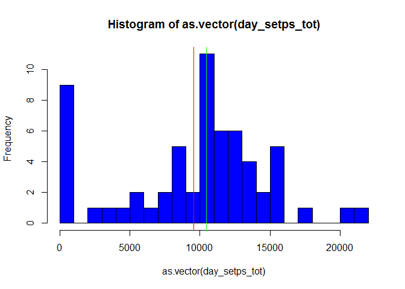
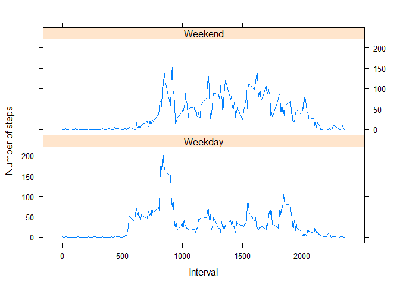

# Reproducible Research: Peer Assessment 1


## Loading and preprocessing the data

Read data from the CSV file. 


```r
setwd("c:/r-prog")
raw_data <- read.csv("activity.csv")
```

## What is mean total number of steps taken per day?

Tapply aggregates the total sum of steps perday and store to variable Steps per day


```r
day_setps_tot <- tapply(raw_data$steps,raw_data$date,sum,na.rm = TRUE)
```
Mean of total Steps per day is 


```r
mean(day_setps_tot)
```

```
## [1] 9354.23
```

and the median is 


```r
median(day_setps_tot)
```

```
## [1] 10395
```

Plotting the data to a histogram to show the total steps per day


```r
library(lubridate)
```

```
## 
## Attaching package: 'lubridate'
```

```
## The following object is masked from 'package:base':
## 
##     date
```

```r
plot(ymd(names(day_setps_tot)),as.vector(day_setps_tot),type = "h",lwd =5,col = "blue",xlab = "Days",ylab = "Total Steps")
abline(h= mean(day_setps_tot),col = "red")
abline(h= median(day_setps_tot),col = "green")
```

<!-- -->

1. Red line is the mean
2. Green line is the median

## What is the average daily activity pattern?

Getting the Average Step per interval and plotting the line graph


```r
Avg_steps_interval <- tapply(raw_data$steps,raw_data$interval,mean,na.rm = TRUE)
plot(names(Avg_steps_interval),Avg_steps_interval,type = "l",xlab = "interval",ylab="Avergae steps")
```

<!-- -->


## Inputing missing values

1. Find the missing values 


```r
raw_data_cleaned <- raw_data
missig_data <- is.na(raw_data_cleaned$steps)
```
Total missing reords is 


```r
sum(missig_data)
```

```
## [1] 2304
```
Cleaning Strategy is to input the mean per interval calculated below and use it to input the NA values
If not found then assigned 0 as no calculation has been performed here


```r
avg_arr <- cbind.data.frame(as.numeric(names(Avg_steps_interval)),round(as.vector(Avg_steps_interval)))
names(avg_arr) <- c("interval","Avg")
raw_data_cleaned[missig_data,"steps"] <- subset(avg_arr,interval==raw_data_cleaned[missig_data,"interval"])$Avg

missig_data <- is.na(raw_data_cleaned$steps)
raw_data_cleaned[missig_data,"steps"] <- 0
```

Ploatting a histogram


```r
day_setps_tot <- tapply(raw_data_cleaned$steps,raw_data_cleaned$date,sum)

plot(ymd(names(day_setps_tot)),as.vector(day_setps_tot),type = "h",lwd =5,col = "blue",xlab = "Days",ylab = "Total Steps")

abline(h= mean(day_setps_tot),col = "red")
abline(h= median(day_setps_tot),col = "green")
```

<!-- -->


## Are there differences in activity patterns between weekdays and weekends?

Adding the weekend and weekday parameter and plotting the data using xyplot


```r
library(lattice)

raw_data_cleaned$day <- ifelse(weekdays(ymd(raw_data_cleaned$date)) %in% c("Sunday","Saturday") , "Weekend", "Weekday")
agg_data <- aggregate(steps~interval*day,data=raw_data_cleaned, mean)

xyplot(steps ~ interval | day, agg_data, type = "l", 
    layout = c(1, 2), xlab = "Interval", ylab = "Number of steps")
```

<!-- -->


